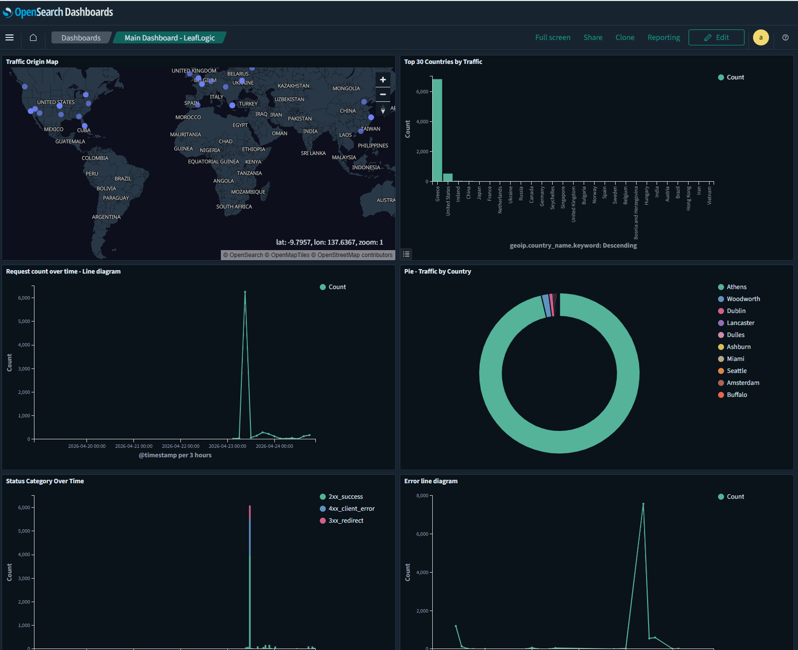

## Setting up Fluent Bit (100% Open Source) on Ubuntu VM


*Example OpenSearch Dashboard visualizing application and access logs with GeoIP.*

Because Elastic changed their license to a non-open-source model for versions 7.11+, the industry standard for OpenSearch is to use **Fluent Bit** (a CNCF graduated project under Apache 2.0 license).

### 1. Install Fluent Bit

```bash
curl https://raw.githubusercontent.com/fluent/fluent-bit/master/install.sh | sh
```

### 2. Deploy Fluent Bit Configuration Files

Copy the pre-configured files from the `z-fluent-bit-config-files` directory:

```bash
sudo cp z-fluent-bit-config-files/fluent-bit.conf /etc/fluent-bit/fluent-bit.conf
sudo cp z-fluent-bit-config-files/parsers.conf     /etc/fluent-bit/parsers.conf
sudo cp z-fluent-bit-config-files/enrich.lua       /etc/fluent-bit/enrich.lua
```

**What each file does:**

- `fluent-bit.conf` — Main pipeline: reads Spring Boot JSON logs and Tomcat access logs, applies filters, sends to OpenSearch via the `tomcat-geoip` ingest pipeline
- `parsers.conf` — Regex parser for Tomcat access log format (extracts `client_ip`, `method`, `request_path`, `status_code`, `response_time_ms`, etc.)
- `enrich.lua` — Pure Lua enrichment script that adds:
    - `status_category` — `2xx_success`, `3xx_redirect`, `4xx_client_error`, `5xx_error`
    - `slow_request` — `true` when `response_time_ms > 2000`
    - `threat_detected` / `threat_type` — detects path traversal, LFI, Windows path probing, sensitive file probing, injection attempts
    - `request_path_clean` — URL-decoded version of the request path
    - `request_category` — `api`, `static`, or `page`

### 3. Enable and Start Fluent Bit

```bash
sudo systemctl enable fluent-bit
sudo systemctl start fluent-bit
sudo systemctl status fluent-bit
```

---

## Setting up GeoIP Enrichment via OpenSearch Ingest Pipeline

GeoIP enrichment is handled entirely by OpenSearch using the native **ip2geo** processor, which automatically downloads and keeps its own GeoIP database up to date from OpenSearch's public endpoint — no external accounts or cron jobs required.

### 1. Create the ip2geo Data Source

This creates a self-updating GeoIP data source inside OpenSearch, refreshed every 3 days automatically:

```bash
curl -k -u 'admin:YOUR_OPENSEARCH_PASSWORD' \
  -X PUT 'https://YOUR_OPENSEARCH_HOST:9200/_plugins/geospatial/ip2geo/datasource/geoip-city' \
  -H 'Content-Type: application/json' \
  -d '{
    "endpoint": "https://geoip.maps.opensearch.org/v1/geolite2-city/manifest.json",
    "update_interval_in_days": 3
  }'
```

Wait a few minutes for the initial download to complete, then verify:

```bash
curl -k -u 'admin:YOUR_OPENSEARCH_PASSWORD' \
  'https://YOUR_OPENSEARCH_HOST:9200/_plugins/geospatial/ip2geo/datasource/geoip-city'
```

The `state` field should show `AVAILABLE`.

### 2. Create the Ingest Pipeline

```bash
curl -k -u 'admin:YOUR_OPENSEARCH_PASSWORD' \
  -X PUT 'https://YOUR_OPENSEARCH_HOST:9200/_ingest/pipeline/tomcat-geoip' \
  -H 'Content-Type: application/json' \
  -d '{
    "description": "GeoIP enrichment for tomcat access logs",
    "processors": [{
      "ip2geo": {
        "field": "client_ip",
        "datasource": "geoip-city",
        "target_field": "geoip",
        "ignore_missing": true,
        "ignore_failure": true
      }
    }]
  }'
```

### 3. Create the Index Template

Ensures correct field mappings for all new daily indices, including `geoip.location` as `geo_point` for map visualizations:

```bash
curl -k -u 'admin:YOUR_OPENSEARCH_PASSWORD' \
  -X PUT 'https://YOUR_OPENSEARCH_HOST:9200/_index_template/tomcat-access-logs-template' \
  -H 'Content-Type: application/json' \
  -d '{
    "index_patterns": ["tomcat-access-logs-*"],
    "template": {
      "settings": {
        "default_pipeline": "tomcat-geoip"
      },
      "mappings": {
        "properties": {
          "client_ip":           { "type": "ip" },
          "status_code":         { "type": "integer" },
          "response_time_ms":    { "type": "integer" },
          "slow_request":        { "type": "boolean" },
          "threat_detected":     { "type": "boolean" },
          "threat_type":         { "type": "keyword" },
          "status_category":     { "type": "keyword" },
          "method":              { "type": "keyword" },
          "request_category":    { "type": "keyword" },
          "traffic_type":        { "type": "keyword" },
          "geoip": {
            "properties": {
              "location":          { "type": "geo_point" },
              "country_name":      { "type": "keyword" },
              "country_iso_code":  { "type": "keyword" },
              "city_name":         { "type": "keyword" }
            }
          }
        }
      }
    }
  }'
```

---

## Viewing Logs in OpenSearch Dashboards

With Fluent Bit active on Ubuntu, **OpenSearch Dashboards** will now receive logs automatically.

### Index Patterns

1. Log in to Dashboards
2. Go to **Stack Management → Index Patterns → Create index pattern**
3. Create two patterns:
    - `springboot-logs*` — select `@timestamp`
    - `tomcat-access-logs*` — select `@timestamp`

### Fields available in `tomcat-access-logs*`

| Field | Type | Description |
|---|---|---|
| `client_ip` | ip | Real client IP (X-Forwarded-For via Nginx) |
| `method` | keyword | HTTP method (GET, POST, etc.) |
| `request_path` | keyword | Raw request path |
| `request_path_clean` | keyword | URL-decoded path |
| `request_category` | keyword | `api`, `static`, or `page` |
| `status_code` | integer | HTTP status code |
| `status_category` | keyword | `2xx_success`, `4xx_client_error`, etc. |
| `response_time_ms` | integer | Response time in milliseconds |
| `slow_request` | boolean | `true` if > 2000ms |
| `threat_detected` | boolean | `true` if attack pattern detected |
| `threat_type` | keyword | `path_traversal`, `lfi_attempt`, etc. |
| `geoip.country_name` | keyword | Country name |
| `geoip.country_iso_code` | keyword | ISO country code |
| `geoip.city_name` | keyword | City name |
| `geoip.location` | geo_point | Lat/lon for map visualizations |
| `traffic_type` | keyword | `human` (default) |

### Real Client IP

Because of the framework properties added in `application.properties` (`server.forward-headers-strategy=framework` alongside `RemoteIpValve`), Tomcat inherently strips the `127.0.0.1` reverse-proxy Nginx IP natively on the server level, permanently ensuring your Spring Logs *and* your Tomcat access logs print the actual remote client IP from the `X-Forwarded-For` header. OpenSearch natively turns this IP into Lat/Long map coordinates inside Dashboards via the ingest pipeline.

---

## Keeping the OpenSearch GeoIP Database Up to Date

The GeoIP database bundled with OpenSearch is static and does not auto-update. To keep it fresh, a monthly cron job runs on the **OpenSearch VM** on the 2nd of every month at 3AM.

### Setup (run once on the OpenSearch VM)

**Step 1 — Install cron:**
```bash
sudo apt-get install -y cron
sudo systemctl enable cron
sudo systemctl start cron
```

**Step 2 — Create the update script:**
```bash
sudo tee /usr/local/bin/update-geoip.sh << 'EOF'
#!/bin/bash
KEY="YOUR_MAXMIND_LICENSE_KEY"
BASE="https://download.maxmind.com/app/geoip_download"
DIR="/usr/share/opensearch/modules/ingest-geoip"

wget -q -O /tmp/GeoLite2-City.tar.gz "$BASE?edition_id=GeoLite2-City&license_key=$KEY&suffix=tar.gz"
wget -q -O /tmp/GeoLite2-Country.tar.gz "$BASE?edition_id=GeoLite2-Country&license_key=$KEY&suffix=tar.gz"
wget -q -O /tmp/GeoLite2-ASN.tar.gz "$BASE?edition_id=GeoLite2-ASN&license_key=$KEY&suffix=tar.gz"

tar -xzf /tmp/GeoLite2-City.tar.gz -C /tmp/
tar -xzf /tmp/GeoLite2-Country.tar.gz -C /tmp/
tar -xzf /tmp/GeoLite2-ASN.tar.gz -C /tmp/

cp /tmp/GeoLite2-City_*/GeoLite2-City.mmdb $DIR/GeoLite2-City.mmdb
cp /tmp/GeoLite2-Country_*/GeoLite2-Country.mmdb $DIR/GeoLite2-Country.mmdb
cp /tmp/GeoLite2-ASN_*/GeoLite2-ASN.mmdb $DIR/GeoLite2-ASN.mmdb

systemctl restart opensearch
EOF

sudo chmod +x /usr/local/bin/update-geoip.sh
```

**Step 3 — Register the cron job:**
```bash
(sudo crontab -l 2>/dev/null; echo '0 3 2 * * /usr/local/bin/update-geoip.sh') | sudo crontab -

# Verify
sudo crontab -l
```

The cron schedule `0 3 2 * *` runs at **3:00 AM on the 2nd of every month**. OpenSearch will be unavailable for ~1-2 minutes during the restart — acceptable for a monthly off-peak maintenance window.

### To run manually at any time:
```bash
sudo /usr/local/bin/update-geoip.sh
```